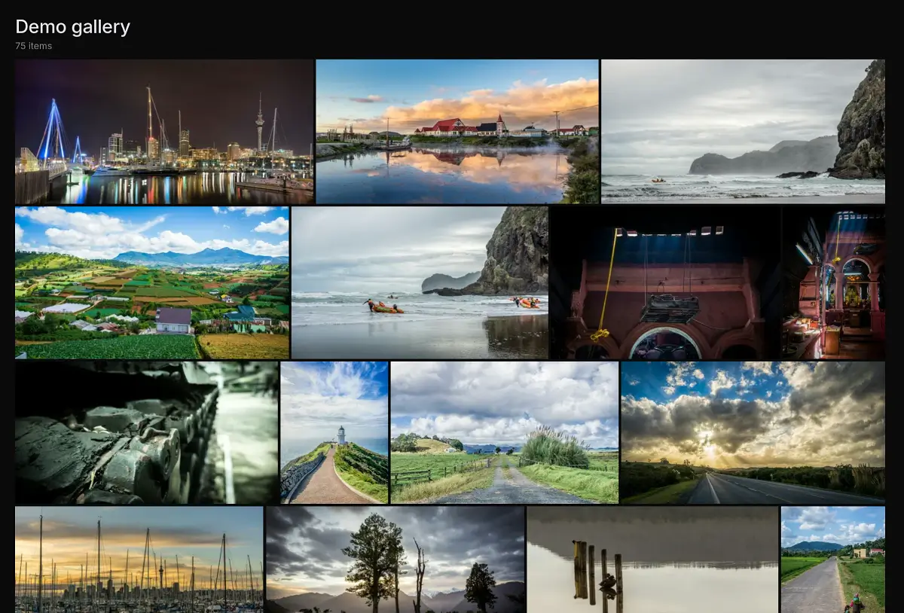

# Immich Public Proxy

Share your Immich photos and albums in a safe way without exposing your Immich instance to the public.

👉 See a [Live demo gallery](https://demo.ipp.nz/s/demo-gallery)
serving straight out of my own Immich instance.

Setup takes less than a minute, and you never need to touch it again as all of your sharing stays managed within Immich.

## About this project

[Immich](https://github.com/immich-app/immich) is a wonderful bit of software, but since it holds all your private photos it's
best to keep it fully locked down. This presents a problem when you want to share a photo or a gallery with someone.

**Immich Public Proxy** provides a barrier of security between the public and Immich, and _only_ allows through requests
which you have publicly shared. In its default configuration it is stateless, needs no API key, and knows nothing about
your Immich instance beyond what you have shared. The one exception is the optional [guest-upload feature](docs/uploads.md):
enabling it requires providing a narrowly-scoped API key so visitors can add photos to a shared album.

Read more in the [Introduction](https://docs.ipp.nz/introduction), including
[why not just expose Immich's `/share/` path](https://docs.ipp.nz/introduction#why-not-expose-immich-directly).

## Requirements

IPP calls a handful of Immich API endpoints directly (no SDK - see [How it works](#how-it-works)), so the version of
Immich you run sets a floor on what works. Versions below are the first release each capability shipped in **upstream
Immich**; check what you're running under Immich → Administration → Server Stats.

| Capability | Minimum Immich version | Notes |
|---|---|---|
| Viewing shared galleries (non-password) | v1.136.0 | Album contents are enumerated via Immich's timeline API - there's no fallback to the older full-album-fetch endpoint. |
| Password-protected shares | v2.6.0 | Uses `POST /shared-links/login`; the older `?password=` query-param auth it replaced is not supported as a fallback. On an older Immich, the password page will never accept a password, even the correct one. |
| Guest uploads (all optional sub-features) | v1.140.0 | See [Uploads](docs/uploads.md#minimum-immich-version) for the per-feature breakdown and what happens on older versions (mostly graceful degradation, not hard failure). |

If your Immich predates v2.6.0, the safest path is to update Immich - self-hosted software you already run behind
your own network is usually the lower-risk half of this pairing to keep current.

## Quick start

1. Download the [docker-compose.yml](https://github.com/alangrainger/immich-public-proxy/blob/main/docker-compose.yml) file.
2. Set `IMMICH_URL` to the local (not public) URL of your Immich server, and `PUBLIC_BASE_URL` to the public URL of IPP.
3. Run `docker-compose up -d` and check that `https://your-proxy-url.com/share/healthcheck` responds.
4. In Immich's **Server Settings**, set the "External domain" to your IPP URL. Every link Immich generates from now on
   points at the proxy.

If you use Cloudflare, set your `/share/video/*` path to Bypass Cache or videos may not play.

Full instructions, including Kubernetes: **[Installation](https://docs.ipp.nz/installation)**.

To let visitors upload photos to shared albums, see **[Uploads](docs/uploads.md)** for how to create a properly-scoped
API key and enable uploads per share. Without that key IPP stays strictly read-only.

## Documentation

Everything is at **[docs.ipp.nz](https://docs.ipp.nz)**:

- [Installation](https://docs.ipp.nz/installation) and [Sharing from Immich](https://docs.ipp.nz/how-to-use)
- [Configuration](https://docs.ipp.nz/config/): downloads, gallery layout, lightbox, metadata privacy, error responses
- [Uploads](docs/uploads.md): letting visitors add photos to a shared album
- Guides: [single domain with Immich](https://docs.ipp.nz/running-on-single-domain),
  [redirect your root domain to a share](https://docs.ipp.nz/redirect-root-to-share),
  [securing Immich with mTLS](https://docs.ipp.nz/securing-immich-with-mtls)
- [Troubleshooting](https://docs.ipp.nz/troubleshooting)

## Feature requests

You can [add feature requests here](https://github.com/alangrainger/immich-public-proxy/discussions/categories/feature-requests?discussions_q=is%3Aopen+category%3A%22Feature+Requests%22+sort%3Atop),
however my goal with this project is to keep it as lean as possible.

The most basic rule for this project is that in its default configuration IPP has **read-only** access to Immich and
stores nothing. The one deliberate exception in this fork is the opt-in [guest-upload feature](docs/uploads.md), which
stays dormant (and IPP stays read-only, with no API key) unless you explicitly provide `IMMICH_API_KEY` and enable
uploads per share in Immich. Anything else that modifies Immich or its files, or requires broader privileges than the
upload feature's narrowly-scoped API key, won't be considered.

The second rule is that IPP is stateless: anything that would require storing a share key (i.e. the code which gives
you access to a share) is unlikely to be added. See [CONTRIBUTING.md](CONTRIBUTING.md) for the full list.
